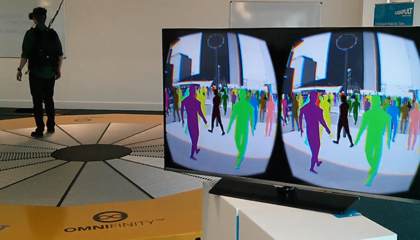

# Computer Graphics

My initial interest in GPU computing was from the perspective of a graphics programmer interested in providing interactive large scale simulations of complex systems such as crowds of people. The advantage of performing simulation on a GPU device is that the data of the individuals in the system is already in the right place to be visualised. The visualisation process simply requires that this data be mapped to a unique geometric representation based on properties about the individual (a processes called instancing). I often describe the advantage of GPU simulation as being that you get visualisation for free. In reality there is a small overhead for visualisation (typically no more that 10% of the simulation time), this is far less than if simulation data was performed elsewhere and had to be transferred to the GPU for rending. As a result of this _'free'_ rendering, GPU simulation is particularly attractive for building interactive simulations. 

I have a keen interest in graphics for rendering of large scale systems and am also interested in Virtual Reality techniques such as use of the Oculus Rift for displaying interactive large scale simulations. I recently installed a technology demonstration at the Transport Systems Catapult which combines a large scale pedestrian dynamics simulation (using FLAME GPU) with an Oculus Rift visualisation. The demonstration takes input from a 360 degree treadmill allowing you to interactively move within a busy crowd of people and see how they react to you. The demonstration is [openly available](https://ts.catapult.org.uk/visualisation-laboratory) if you are in the Milton Keynes area. 

