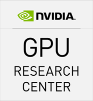

# GPUComputing@Sheffield

In 2012 I founded [GPUComputing@Sheffield](http://gpucomputing.sites.sheffield.ac.uk/discussion) in order to support GPU computing at the University of Sheffield. Since 2011 the university has been recognised as an [NVIDIA GPU research centre]() (formally NVIDIA CUDA research centre). In 2013 Mike Griffiths of CICS joined as co-investigator to the GPU Research Centre program and together we have delivered a number of training sessions to research staff promoting GPU computing. If you have GPU related technical questions then the GPUComputing@Sheffield discussion group is the place to ask. Likewise if you join the [google group and mailing-list](https://groups.google.com/a/sheffield.ac.uk/forum/#!forum/gpucomputing) you will get priority access to training events and seminars.

If you have specific requests for GPU training or hardware assistance [GPUComputing@Sheffield](http://gpucomputing.sites.sheffield.ac.uk/discussion) is a great place to start!

If you are a researcher working on GPU computing then join the group and introduce yourself if you have not already.

