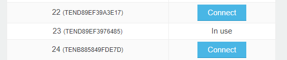
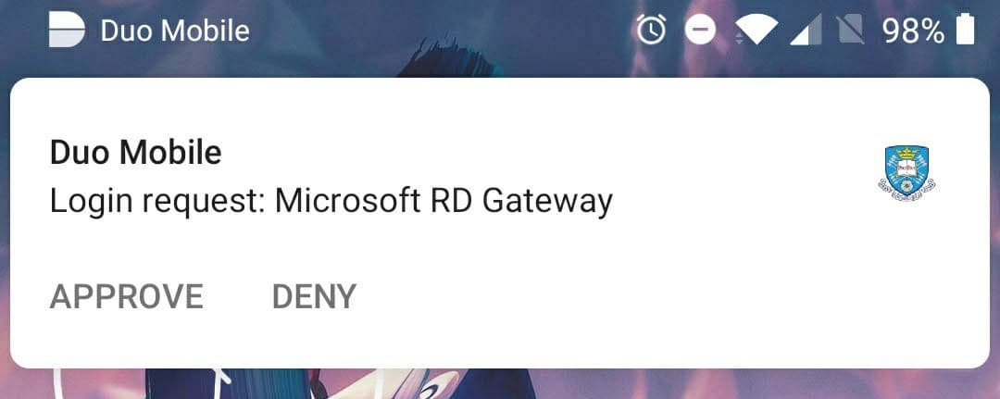
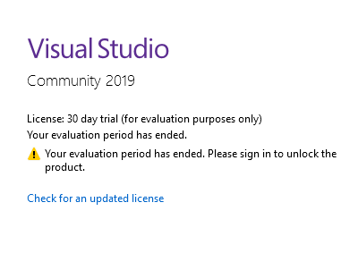
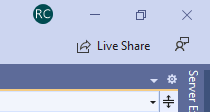
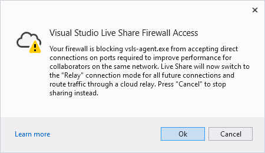
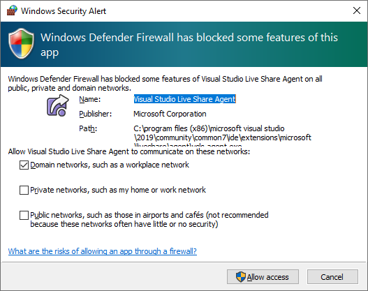
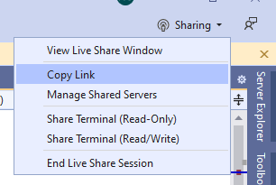
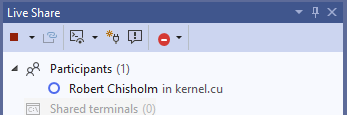
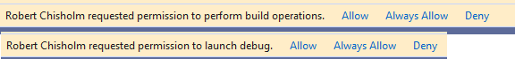
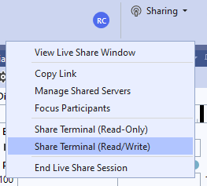

# COM4521/COM6521 Lab Class Guidance

Lab classes for this module are held virtually with support available from instructors via the Mole (vle.sheffield.ac.uk) course rooms.

## Joining a lab class

1) Lab classes should be joined via Blackboard. Once you log in and select the module you will have alink on the main Module Content page for **Lab Class Session (Backboard Collaborate)**. This link will provide you with a list of lab sessions for each teaching week.

2) Once you have joined a session, to request help you can select the raise hand icon at the bottom of the screen. One of the lab demonstratiors will move you in to a private break-out room for discussion. 

## Logging into a machine

The majority of lab classes for this module require a computer with an NVIDIA GPU. The course [main page](../) has details of machines which are availabel to you. Connecting remotely to university machines requires:
* [2-factor authentication with mobile push notifications](https://sites.google.com/sheffield.ac.uk/mfa?pli=1&authuser=1).
* [Connecting to the university VPN](https://www.sheffield.ac.uk/it-services/vpn) (if you are not on the campus network).
* Mac users may need to install [Microsoft Remote Desktop](https://apps.apple.com/us/app/microsoft-remote-desktop/id1295203466?mt=12).

1) Connect to the university VPN. The legacy VPN system will be disabled during this semester, therefore it will be necessary to install the 'FortiClient' to use VPN. Guidenace for setting up the new VPN client on your local machine can be found [here](https://www.sheffield.ac.uk/it-services/vpn).

2) Visit [this page](https://www.sheffield.ac.uk/findapc/rdp/room/37/pcs) and select a free machine by clicking 'Connect' to download a remote desktop connection file.

3) Open the downloaded remote desktop connection file. You will be asked to enter you university password.

4) After entering your password, you should recieve a push notification from the Duo app on your mobile phone. If the notification has not appeared, try opening the app.  If this still fails, you likely don't have your account attached to that Duo app and may need to add it via the "Add a new device" option from the 2-factor authentication screen  when logging into the website.

5) When you first open Visual Studio 2019 on a remote machine you may be asked to login to validate the license.
Click "Check for an updated license", and select your user account.

6) You should now be ready to complete the lab classes. Materials for the lab classes can be downloaded from the [course website](https://paulrichmond.shef.ac.uk/teaching/COM4521/). This will be updated weekly to add the new lab material and the previous weeks lab solutions.

## Remote Assistance

You can share your Visual Studio session with a lab demonstrator by completing the following steps:

1)  In the top right corner of Visual Studio click the 'Live Share' button

2) Click ok to pass the next dialog

3) Click cancel if a windows firewall dialog appears.

4) When live share has initialised, the "Live Share" button will change to "Sharing". Click it will now give you the option to copy the share link. Copy this link and send it to the lab assistant when you have been moved to a private room in the Mole classroom.

5) When the lab assistant has connected you should recieve a notification and they will appear as a participant in the Live Share panel.

6) Whilst providing support, the lab assistant may request access to edit/build/run your code. This will appear as a yellow bar. If the name of the request corresponds to a lab assistant, you should approve these requests.

7) It may also be necessary to share read/write access to a terminal window. (Remote participants cannot see the output window when debugging, but can execute the application manually from the shared terminal window).

**Note:** CUDA debugging is not currently supported during live sharing sessions, if the CUDA debugger break points into device code, the remote participant will be disconnected and unable to reconnect until the debugger has exited.

